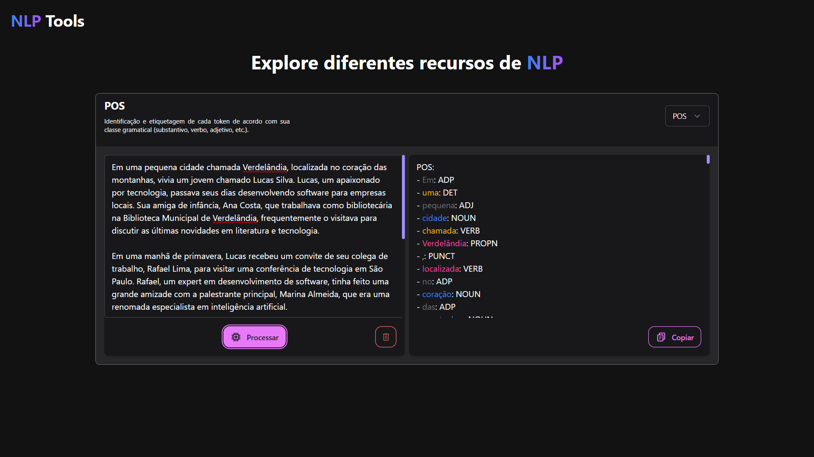

# NLP Tools

{:width="600px"}

O NLP Tools é um projeto que recebe textos como entrada e pode executar as seguintes tarefas:

- **Resumir**: Faz um resumo do texto extraindo as frases mais importantes. (Resumo extrativo)
- **Tokenização**: Separação de um texto em unidades menores (tokens)
- **POS (Part-of-Speech)**: Identificação e etiquetagem de cada token de acordo com sua classe gramatical (substantivo, verbo, adjetivo, etc.)
- **NER (Named Entity Recognition)**: Extração de entidades como pessoas, organizações, etc., de um texto.
- **Lematização**: Transformação de palavras em sua forma base ou raiz.

## Executando o projeto sem o Docker

### Backend

1. Instale as dependências listadas em `requirements.txt` com o comando `pip install -r requirements.txt`
2. Execute o arquivo `app.py` com o comando `python app.py`

### Frontend

1. Instale as dependências do Nuxt com o comando `npm install`
2. Execute o Nuxt com o comando `npm run dev`

## Executando o projeto com o Docker

1. Execute o comando `docker-compose up --build` para subir o container e executar o projeto.
2. Acesse o frontend em `http://localhost:3000`

Obs: É necessário ter o Docker instalado e configurado na máquina.
